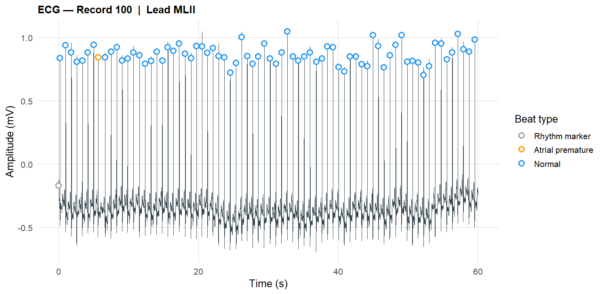
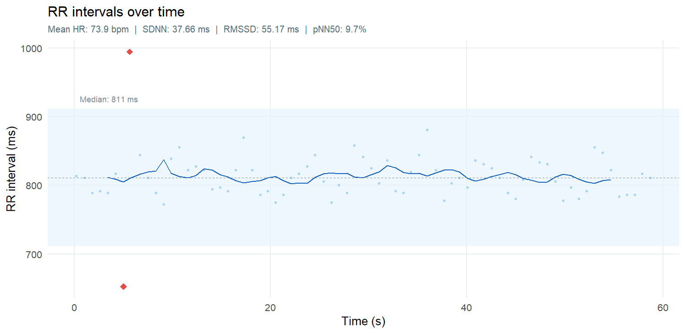

# ecgR -- ECG Signal Analysis Toolkit

`ecgR` is an R package for **reading, processing, and interpreting
electrocardiogram (ECG) signals**. It provides a lightweight workflow
for loading MIT-BIH ECG records, visualizing signals, computing heart
rate variability (HRV), and generating structured interpretations.

The package is designed for **research, teaching, and exploratory ECG
analysis**.

------------------------------------------------------------------------

# Features

-   Read **MIT-BIH ECG records** (`.dat` / `.hea`)
-   Plot **ECG waveforms with beat annotations**
-   Compute **Heart Rate Variability (HRV)** metrics
-   Visualize **RR interval dynamics**
-   Extract **ECG signal features**
-   Generate **automatic interpretation summaries**

------------------------------------------------------------------------

# Installation

Install from GitHub:

``` r
install.packages("devtools")

devtools::install_github("LuisSlight/ecgR")

library(ecgR)
```

------------------------------------------------------------------------

# Example Workflow

This example analyzes the **first 60 seconds of MIT-BIH record 100**.

``` r
library(ecgR)

# Path to MIT-BIH record (without extension)
record_path <- "path/to/100"

# Read ECG data
df <- read_ecg(record_path, from_sec = 0, to_sec = 60)

# Plot ECG waveform
plot_ecg(df)

# Compute HRV metrics
hrv <- compute_hrv(df)

# Plot RR intervals
plot_rr(hrv)

# Extract ECG features
features <- extract_ecg_features(df)

# Interpret HRV
interpret_hrv(hrv)

# Interpret ECG features
interpret_ecg_features(features)
```

------------------------------------------------------------------------

# Example: ECG Waveform

Example ECG waveform visualization.



This plot shows:

-   Raw ECG signal
-   Detected beats
-   Beat type annotations

------------------------------------------------------------------------

# Example: RR Interval Dynamics

RR interval variability across time.



Displayed metrics include:

-   Mean HR
-   SDNN
-   RMSSD
-   pNN50

------------------------------------------------------------------------

# Example HRV Output

    === HRV Summary ===

    Mean heart rate : 73.9 bpm
    SDNN            : 37.66 ms
    RMSSD           : 55.17 ms
    pNN50           : 9.7 %

    Beat counts:

     +  A  N
     1  1 73

------------------------------------------------------------------------

# Example Interpretation

    Resting heart rate is 73.9 bpm, which is within the normal range (60–100 bpm).

    Overall HRV (SDNN: 37.66 ms) is slightly below the range typically seen in healthy adults (>50 ms).

    Short-term HRV (RMSSD: 55.17 ms) reflects healthy parasympathetic regulation.

    1 atrial premature beat was detected. Occasional premature beats are common and usually benign.

------------------------------------------------------------------------

# Feature Extraction Example

`extract_ecg_features()` produces a structured feature object.

Example summary:

    rate_rhythm:
      mean_hr : 73.9
      SDNN    : 37.7
      RMSSD   : 55.2
      pNN50   : 9.7

    signal_quality:
      grade : good

    morphology:
      QRS stability : stable

------------------------------------------------------------------------

# Data Source

This example uses the **MIT-BIH Arrhythmia Database**:

https://physionet.org/content/mitdb/1.0.0/

Example record used:

    Record 100
    Lead MLII
    Sampling rate: 360 Hz
    Duration analyzed: 60 seconds

------------------------------------------------------------------------

# Output Files Generated

Running the example script produces:

    ecg_waveform.png
    rr_intervals.png
    ecg_interpretation.txt

------------------------------------------------------------------------

# License

MIT License

------------------------------------------------------------------------

# Project Status

`ecgR` is under active development.

Future improvements may include:

-   Extended morphology analysis
-   Additional ECG feature detection
-   Interactive Shiny dashboards
-   Improved visualization tools
